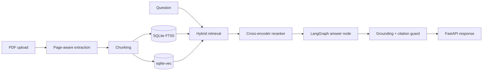

# Production RAG with Page Citations

A production-shaped PDF question-answering service that combines **lexical + vector retrieval**, **cross-encoder reranking**, strict **page-level citations**, and a grounding guard before responses reach the client.

## Why this project exists

A basic RAG demo can retrieve chunks and call an LLM. A production RAG system also needs to answer:

- Where did the answer come from?
- Did retrieval use both exact terms and semantic similarity?
- Was the strongest evidence reranked?
- Can the answer cite only pages that were actually retrieved?
- What happens when grounding fails?
- Can the service be tested, containerized, and operated as an API?

This implementation addresses those concerns while remaining small enough to understand end to end.

## Architecture



## Stack

- **LangGraph** — explicit retrieve → rerank → answer → grounding workflow
- **SQLite FTS5** — lexical retrieval
- **sqlite-vec** — local vector search
- **Sentence Transformers** — local embeddings
- **CrossEncoder** — second-stage reranking
- **FastAPI** — HTTP API
- **PyPDF** — page-aware PDF extraction
- **Docker + GitHub Actions** — reproducible build and CI

## Retrieval strategy

1. Index each PDF page into overlapping chunks while preserving the original page number.
2. Run FTS5 lexical search.
3. Run semantic KNN search with sqlite-vec.
4. Fuse both result sets using **Reciprocal Rank Fusion (RRF)**.
5. Rerank the fused candidates using `cross-encoder/ms-marco-MiniLM-L6-v2`.
6. Give only the top evidence to the model.

Cross-encoders are intentionally used after first-stage retrieval because they are usually more accurate but more computationally expensive than bi-encoder retrieval.

## Grounding contract

The model receives evidence in this form:

```text
[p.7 | annual-report.pdf]
<retrieved text>
```

It is instructed to cite factual claims with `[p.N]`. The final guard rejects:
- answers with no page citations;
- citations to pages not present in retrieved evidence.

The API then returns the answer plus structured source metadata.

## Run locally

```bash
cd ai-engineering-lab/production-rag
python -m venv .venv
source .venv/bin/activate
pip install -e .
cp .env.example .env
uvicorn app.main:app --reload
```

Default generation uses a local Ollama model:

```bash
ollama pull llama3.2:3b
```

Set `MODEL_PROVIDER=openai` and `OPENAI_API_KEY` to use an OpenAI model instead.

## API

### Ingest a PDF

```bash
curl -F "file=@report.pdf" http://localhost:8000/ingest
```

### Ask a question

```bash
curl -X POST http://localhost:8000/ask \
  -H "Content-Type: application/json" \
  -d '{"question":"What were the main risks discussed?"}'
```

Example response:

```json
{
  "answer": "The report highlights supply-chain and transition risks [p.12].",
  "sources": [
    {"source":"report.pdf","page":12,"score":0.88}
  ]
}
```

## Tests

```bash
pytest
ruff check .
```

The unit tests cover deterministic engineering logic such as RRF fusion and citation validation without requiring an LLM call.

## Known limitations

- `sqlite-vec` is currently pre-v1 and can introduce breaking changes.
- Text extraction does not include OCR for scanned PDFs.
- The local cross-encoder adds latency on CPU; production deployments should batch or accelerate reranking.
- This version is single-tenant and intentionally leaves authentication to a later portfolio system.

## Next engineering upgrades

- tracing and request metrics with OpenTelemetry;
- automated RAG eval suite and regression gate;
- prompt-injection and PII middleware;
- model router with per-request cost telemetry;
- streaming UI.
